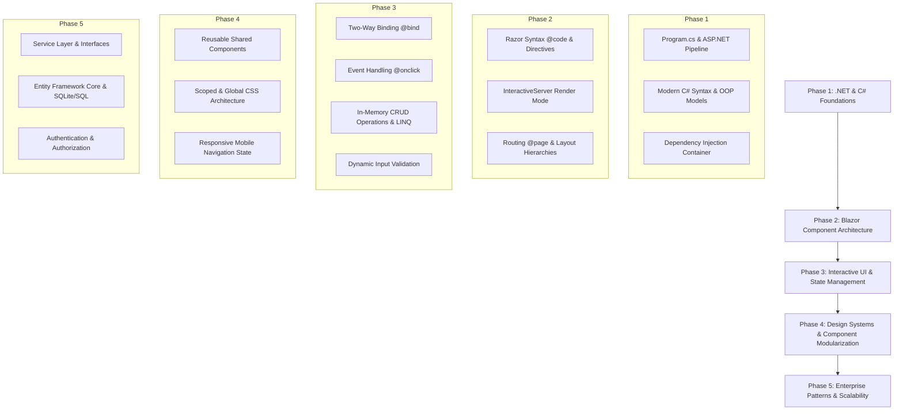

<div align="center">

# 📝 Note_Daily

**A Modern, Component-Driven Web Application built with .NET 10, C#, and Blazor Interactive Server.**

[](https://dotnet.microsoft.com/)
[](https://dotnet.microsoft.com/apps/aspnet/web-apps/blazor)
[](https://learn.microsoft.com/dotnet/csharp/)
[](https://dotnet.microsoft.com/)
[](LICENSE)
[](https://github.com/WagyuuA5/Note_Daily/pulls)

<p align="center">
  <a href="#about-the-project">About The Project</a> •
  <a href="#learning-roadmap--curriculum-flow">Learning Flow</a> •
  <a href="#key-features">Key Features</a> •
  <a href="#tech-stack--architecture">Tech Stack & Architecture</a> •
  <a href="#getting-started">Getting Started</a> •
  <a href="#project-structure">Project Structure</a> •
  <a href="#next-milestones">Next Milestones</a>
</p>

---

</div>

## 📌 About The Project

**Note_Daily** is designed and crafted as a structured, professional learning repository for developers mastering **C#**, **Blazor (Interactive Server)**, and the **.NET modern ecosystem**.

Rather than relying on basic "Hello World" tutorials, this project simulates real-world enterprise development workflows:
- **Clean Component Modularization**: Decoupled UI blocks (`Hero`, `FeatureCards`, `NavMenu`).
- **Interactive Single-Page Application (SPA) UX**: High-performance UI state updates powered by Blazor Server SignalR circuits without full-page reloads.
- **Robust C# Fundamentals**: Object-oriented models, LINQ queries, two-way data binding, event dispatching, and error handling.
- **Enterprise-Ready Extensibility**: Scalable folder structure pre-configured for Domain Models (`models/`), Data Access / Repositories (`Data/`), and Business Logic Services (`service/`).

---

## 🧭 Learning Roadmap & Curriculum Flow

This repository follows a progressive, step-by-step curriculum designed to transition a developer from foundational concepts to professional-grade Blazor engineering.



### 1. Phase 1: .NET 10 Core & C# Foundations
- **Application Startup Pipeline (`Program.cs`)**: Understanding how `WebApplication.CreateBuilder` configures services, registers Blazor Razor components, configures HTTP request pipelines, and sets up exception handlers and static asset mapping (`MapStaticAssets`).
- **C# Language Features**: Using modern C# syntax such as target-typed `new()`, nullable reference types (`<Nullable>enable</Nullable>`), sealed classes, and properties with expression-bodied accessors.

### 2. Phase 2: Blazor Component Model & Lifecycle
- **Razor Syntax**: Blending HTML markup seamlessly with C# logic using `@` directives.
- **Render Modes**: Deep dive into `@rendermode InteractiveServer` where client interactions execute over a persistent bi-directional SignalR connection with zero JavaScript overhead.
- **Component Hierarchies**: Distinguishing between routed page components (`/Pages`), layout components (`/Layout`), and presentation components (`/Shared`).

### 3. Phase 3: Interactive State & Event Handling (Practical CRUD)
- **Two-Way Data Binding (`@bind`)**: Syncing form input states directly to C# variables in real time.
- **Event Handling (`@onclick`)**: Triggering C# delegates and methods from user interactions.
- **In-Memory Collection Management**: Performing clean CRUD operations (Add, Complete/Toggle, Remove) using generic `List<T>` and querying real-time progress using C# LINQ (`tasks.Count(t => t.IsCompleted)`).
- **Validation Feedback**: Implementing reactive validation messages for user feedback when input constraints fail.

### 4. Phase 4: UI Modularization & Design Systems
- **Separation of Concerns**: Splitting oversized pages into self-contained, atomic components:
  - [`Hero.razor`](Components/Shared/Hero.razor): Engaging call-to-action hero banner with glassmorphism badge elements.
  - [`FeatureCards.razor`](Components/Shared/FeatureCards.razor): Reusable value proposition grid with embedded inline SVGs.
  - [`NavMenu.razor`](Components/Layout/NavMenu.razor): Clean navigation bar featuring responsive mobile hamburger drawer state management.
- **Styling Architecture**: Combining custom modern CSS styling (`app.css`) with lightweight utility styling for responsive typography and layout grids.

### 5. Phase 5: Enterprise Next Steps (Production-Readying)
- Decoupling UI from business logic via service interfaces (Dependency Injection).
- Introducing persistent storage via Entity Framework Core (EF Core) and SQLite / PostgreSQL.
- Implementing unit tests with `bUnit` and `xUnit`.

---

## ⚡ Key Features

| Feature | Description | File Reference |
| :--- | :--- | :--- |
| 🚀 **Interactive Task Board** | Full task management with reactive checkbox completion, counter badges, input validation, and item deletion. | [`Todo.razor`](Components/Pages/Todo.razor) |
| 🎨 **Modern Landing Page** | Polished hero section with glassmorphism UI accents, responsive action buttons, and feature summaries. | [`Home.razor`](Components/Pages/Home.razor) |
| 📱 **Responsive Navigation** | Interactive header navbar with hamburger toggle menu for mobile viewports without external JS libraries. | [`NavMenu.razor`](Components/Layout/NavMenu.razor) |
| 🧱 **Reusable Shared UI** | Modular UI components that can be plugged into any page to maintain DRY (*Don't Repeat Yourself*) code. | [`Hero.razor`](Components/Shared/Hero.razor), [`FeatureCards.razor`](Components/Shared/FeatureCards.razor) |
| 🛡️ **Defensive Code & UX** | Graceful fallback routes (`/not-found`), custom error boundaries, and input sanitation. | [`Program.cs`](Program.cs), [`Todo.razor`](Components/Pages/Todo.razor) |

---

## 🛠️ Tech Stack & Architecture

- **Language:** [C# 12 / 13](https://learn.microsoft.com/dotnet/csharp/)
- **Framework:** [.NET 10.0 ASP.NET Core](https://dotnet.microsoft.com/)
- **Application Model:** Blazor Interactive Server Components
- **Markup & Styling:** Razor Syntax, HTML5, Vanilla CSS3 (Custom Glassmorphism + Flexbox/Grid)
- **Tooling:** Visual Studio 2022 / Visual Studio Code / .NET CLI

### Architectural Breakdown

```
Client (Browser)
   │  ▲
   │  │  WebSocket (SignalR Circuit)
   ▼  │
┌────────────────────────────────────────────────────────┐
│ ASP.NET Core Blazor Interactive Server Engine          │
│                                                        │
│  ┌─────────────────┐      ┌─────────────────────────┐  │
│  │ Components/     │      │ Components/             │  │
│  │ Pages           │◄────►│ Shared                  │  │
│  │ (Home, Todo)    │      │ (Hero, FeatureCards)    │  │
│  └────────┬────────┘      └─────────────────────────┘  │
│           │                                            │
│           ▼                                            │
│  ┌──────────────────────────────────────────────────┐  │
│  │ State / Business Logic (C# Domain & Collections) │  │
│  └──────────────────────────────────────────────────┘  │
└────────────────────────────────────────────────────────┘
```

---

## 📂 Project Structure

```text
Note_Daily/
├── BlazorApp1_newproject/
│   ├── Components/
│   │   ├── App.razor                 # Root HTML document & router host
│   │   ├── _Imports.razor            # Global Razor namespaces & tag helpers
│   │   ├── Data/                     # Data context & repository layer (Extensible)
│   │   ├── models/                   # Business entities & DTO models (Extensible)
│   │   ├── service/                  # Application & domain services (Extensible)
│   │   ├── Layout/                   # Global layout templates
│   │   │   ├── MainLayout.razor      # Primary application master shell
│   │   │   ├── MainLayout.razor.css  # Scoped styles for the master shell
│   │   │   ├── NavMenu.razor         # Navigation bar & mobile drawer
│   │   │   └── ReconnectModal.razor  # SignalR connection loss handling
│   │   ├── Pages/                    # Routable page components
│   │   │   ├── Home.razor            # Landing / Dashboard view ("/")
│   │   │   ├── Todo.razor            # Interactive Task Management ("/tasks")
│   │   │   └── About.razor           # Project info & overview ("/about")
│   │   └── Shared/                   # Presentational & reusable components
│   │       ├── Hero.razor            # Call-to-action hero banner
│   │       └── FeatureCards.razor    # Value proposition highlight cards
│   ├── Properties/
│   │   └── launchSettings.json       # Development profiles (IIS Express, Kestrel)
│   ├── wwwroot/                      # Static assets
│   │   ├── app.css                   # Global stylesheets
│   │   └── lib/                      # Vendor styling utilities
│   ├── appsettings.json              # Configuration settings
│   ├── BlazorApp1_newproject.csproj  # Project file & target framework (.NET 10)
│   └── Program.cs                    # Application bootstrapping & middleware
├── BlazorApp1_newproject.sln         # Visual Studio Solution file
└── README.md                         # Documentation & learning path
```

---

## 🚀 Getting Started

### Prerequisites

Ensure you have the following installed on your machine:
- [.NET 10 SDK](https://dotnet.microsoft.com/download) (or .NET 8 / 9 SDK)
- An IDE of your choice:
  - [Visual Studio 2022](https://visualstudio.microsoft.com/) (version 17.12+ recommended with the ASP.NET & web development workload)
  - [Visual Studio Code](https://code.visualstudio.com/) with the **C# Dev Kit** extension
  - [JetBrains Rider](https://www.jetbrains.com/rider/)

### Installation & Run

1. **Clone the repository:**
   ```bash
   git clone https://github.com/WagyuuA5/Note_Daily.git
   cd Note_Daily
   ```

2. **Navigate into the project directory:**
   ```bash
   cd BlazorApp1_newproject
   ```

3. **Restore dependencies:**
   ```bash
   dotnet restore
   ```

4. **Build the application:**
   ```bash
   dotnet build
   ```

5. **Run the development server:**
   ```bash
   dotnet watch
   ```
   *Using `dotnet watch` enables Hot Reload for instant updates as you edit Razor files!*

6. **Open in your browser:**
   ```
   http://localhost:5000 or https://localhost:5001
   ```

---

## 🗺️ Next Milestones & Extensibility Roadmap

This project is actively maintained as an educational baseline. The planned upgrades include:

- [ ] **Data Persistence:** Integrate **Entity Framework Core** with an SQLite database to persist tasks across server restarts.
- [ ] **Service & Repository Pattern:** Move data manipulation from `Todo.razor` into an `ITaskService` registered via Dependency Injection (`builder.Services.AddScoped<ITaskService, TaskService>()`).
- [ ] **Rich Task Attributes:** Add due dates, priority labels (Low / Medium / High), and categories.
- [ ] **Authentication & Security:** Implement ASP.NET Core Identity for multi-user support.
- [ ] **Unit & Component Testing:** Add automated UI component unit testing using `bUnit`.

---

## 🤝 Contributing

Contributions, issues, and feature suggestions are welcome!

1. Fork the repository.
2. Create your feature branch (`git checkout -b feature/AmazingFeature`).
3. Commit your changes (`git commit -m 'feat: add AmazingFeature'`).
4. Push to the branch (`git push origin feature/AmazingFeature`).
5. Open a Pull Request.

---

## 📄 License

This project is open source and available under the [MIT License](LICENSE).

---

<div align="center">
  <sub>Built with  by <a href="https://github.com/WagyuuA5">WagyuuA5</a> as a hands-on journey into modern .NET and Blazor development.</sub>
</div>
